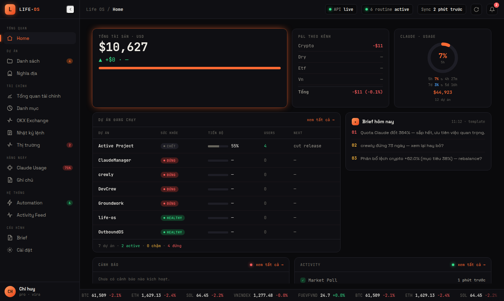

# Life OS — Personal AI Operating System

> An all-in-one life-tracing OS: track projects, finance/portfolio, Claude-Code usage, and notes — with a rule-based automation layer — all in one dark command center.

🔗 **Live demo:** [demo.tinhdev.com/life-command](https://demo.tinhdev.com/life-command/life-command.html)

---

## Features

- **🗂️ Project tracking** — every project at a glance: progress, health, users, last activity, and what's next. Flags projects stuck at ~90% with 0 users.
- **💰 Finance & portfolio** — total assets, allocation by channel, P&L, and a ladder/DCA tracker for an investment plan.
- **📊 Claude-Code usage** — live token burn, quota %, and reset countdown for Claude sessions.
- **📈 Market & alerts** — real-time prices with threshold alerts (desktop / Discord / in-app).
- **📝 Notes & journal** — markdown notes tied to projects, plus a decision journal with calibration tracking.
- **⚙️ Automation** — rule-based routines that run on a schedule: market polling, idle-project alerts, a "stuck-at-90%" pattern check, and a daily brief.
- **🤖 AI-ready** — the API is the source of truth, so an external AI (Claude Code via MCP) can read your data and assist. No LLM is embedded in the app itself.

## Screenshots / Demo



*The Home command center: total assets, P&L by channel, live Claude-usage quota, running projects, today's brief, alerts & activity — all on one screen.*

▶️ **[Open the live demo](https://demo.tinhdev.com/life-command/life-command.html)**

## Tech

**FastAPI** (backend) · **Next.js** (frontend) · **Markdown-on-git + SQLite** (storage) · **APScheduler** (automation) · **Docker Compose**.

- **Module/registry architecture** — each feature is a self-contained folder (`router · schema · service · reader`) that a registry auto-discovers at startup. *Adding a feature = adding a folder* (12 modules, 14 screens).
- **Markdown-on-git storage** — human-readable state with free version history (every write is a commit). SQLite handles time-series.
- **Tested** — ~1,089 automated tests (pytest + vitest).

*Built solo in ~11 hours.*

## Run locally

```bash
docker compose up -d        # backend :8686 · frontend :3010 (hot-reload)
```

Single-user by design — no auth, no multi-tenant, no billing.

## Star History

[](https://star-history.com/#tinhnguyen0110/life-os&Date)

## License

MIT
